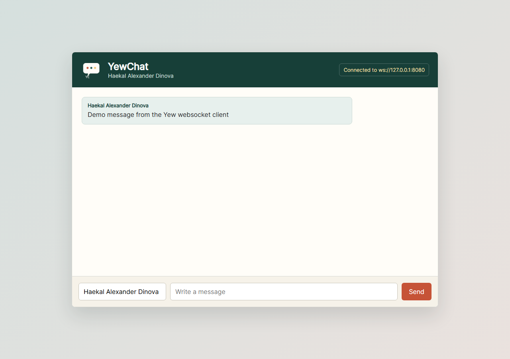

# Module 10 YewChat

## Identity

Signature: **Haekal Alexander Dinova**

## Project Description

This repository contains Tutorial 3 for Module 10: Asynchronous Programming. The project implements a Yew web chat client that communicates with a websocket broadcast server using JSON messages.

## How to Run

Install the JavaScript dependency:

```bash
npm install
```

Start the JavaScript websocket server:

```bash
npm run server:js
```

Start the Yew web client in another terminal:

```bash
trunk serve --address 127.0.0.1 --port 8000
```

Open `http://127.0.0.1:8000` in the browser.

## Experiment 3.1: Original Code

In this experiment, I implemented the original Yew webchat flow from the tutorial reference with a websocket server and browser client. The Yew client connects to `ws://127.0.0.1:8080` and sends messages as JSON in the form `{ "sender": "...", "text": "..." }`. The JavaScript websocket server in `server-js/server.js` receives each JSON payload and broadcasts it to every connected browser client. The client listens for broadcast messages, parses the JSON, and renders each message inside the chat panel. The screenshot was captured with a demo query parameter that automatically sends a message from the Yew client after the websocket connection opens. The server log confirmed that the JavaScript websocket server received and broadcast the same JSON payload.



## Commit and Pull Request Links

The final commit and pull request links will be collected after all experiment pull requests are merged.
